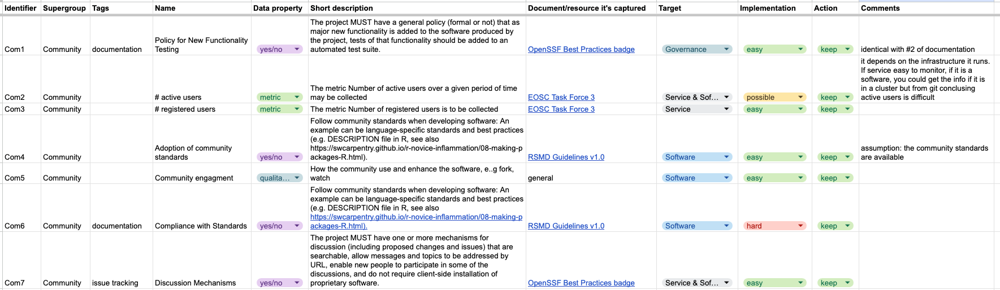

# Curating Software Quality Indicators for Research Software

## 1. Introduction

The primary goal of this project is to perform a comprehensive cross-walk of existing indicators related to research software quality, resulting in a curated catalogue that reflects shared understanding and practical usability. This work was carried out as part of BioHackathon Europe 2025 (Project 5), with a focus on supporting the ELIXIR Research Software Ecosystem while aiming for applicability across the broader Life Sciences community.

Assessing the quality of research software remains a recognized challenge, with significant variability in the maturity and adoption of indicators across domains. Our goal was to address this by collecting, comparing, and consolidating existing indicators into a structured format, removing redundancy, and highlighting relevance to common use cases in scientific software evaluation.

The resulting catalogue is designed to:

- Raise awareness of current best practices and services in research software.
- Clarify the requirements and expectations of these services.
- Help users identify the most appropriate quality assessment approach for their specific context.
- Reveal gaps in community-specific practices or support tools.
- Offer a foundation for adopting common indicators across different scientific domains.

Through this work, we aim to support a shared vocabulary around software quality, enable meaningful comparisons across tools and frameworks, and facilitate a more coherent ecosystem for sustainable, trustworthy research software.

### Project Scope and Outcome

Research software plays a vital role in modern scientific work, and assessing its quality is essential for reproducibility, sustainability, and trust. The goal of this project was to create a curated, non-redundant set of indicators that are relevant, feasible to implement, and applicable to the assessment of research software best practices.

Specifically, we aimed to:

- Gather indicators from established resources.
- Remove indicators that are out of scope, overly philosophical, or redundant.
- Assign supergroups and tags to support practical use.
- Produce a usable spreadsheet of indicators annotated with implementation guidance and decisions.

The final outcome is a structured dataset of quality indicators, accompanied by documentation of decision criteria and rationale. While the list does not include prioritization or ranking, it can be adapted for specific use cases. Future users may wish to introduce weighting schemes based on context.

### Expected Users

This resource is intended for:

- Research software developers and maintainers.
- Funders and evaluators (e.g., EVERSE WP3, RSQKit, STEERS).
- Anyone seeking to assess research software against quality best practices.

## 2. Method

### 2.1 Sources Included

We reviewed indicators from a variety of authoritative sources:

- [EOSC Task Force 3](https://zenodo.org/records/10647227)
- [FLOSS Best Practices Criteria](https://www.bestpractices.dev/en/criteria/0)
- [RSMD Guidelines](https://fair-impact.github.io/RSMD-guidelines/)
- [FAIR IMPACT D5.2 – Metrics for Automated FAIR Software Assessment](https://doi.org/10.5281/zenodo.10047401)
- [Helmholtz Quality Indicator](https://github.com/EVERSE-ResearchSoftware/RSQuality_indicators/issues/5)
- [ISO/IEC 25010](https://iso25000.com/index.php/en/iso-25000-standards/iso-25010)
- [SWEBOK v4 – Chapter 12: Software Quality](https://ieeecs-media.computer.org/media/education/swebok/swebok-v4.pdf)

### 2.2 Sources Excluded

Several sources were not included due to either duplication, minimal added value, or being overly narrow:

- STEERS scoreboard
- Software Citation Workshop 2022 indicators
- Reproducible builds (focused on a single criterion)
- Bioinformatics SE practices (descriptive rather than indicator-focused)

### 2.3 Workflow

The work was initiated at BioHackathon 2025 (Project 5) and refined through a collaborative review process:

The work was initiated at BioHackathon Europe 2025 (Project 5) and refined through a collaborative review process:

1. **Collection**: Over 300 indicators were gathered from selected sources.

2. **Grouping**: Indicators were assigned to thematic “supergroups” based on their primary focus (e.g., Documentation, Security, Sustainability).

3. **Parallel Evaluation of Each Indicator**:  
   For each indicator, three types of review were carried out in parallel:

   - **Target**: We classified whether the indicator applied to software, services, governance, or architecture/design.
   - **Implementation Feasibility**: We assessed how easily a person (rather than a machine) could evaluate whether the indicator was being met. This was not a measure of compliance quality, but of assessability.
   - **Action Decision**: We assigned an action:
     - **Keep**: The indicator was considered relevant and feasible.
     - **Maybe**: The indicator’s value was uncertain or context-dependent.
     - **Discard**: The indicator was redundant, too vague, or philosophical (e.g., "immutable infrastructure").

   - **Tagging**: We also added supplementary tags to help identify indicators relevant to cross-cutting themes such as testing, findability, or community practices.
   - **Redundancy Checks**: We identified indicators that duplicated the intent or content of others — whether within the same supergroup or across different ones — and marked them as redundant. These were either discarded or annotated in the comments for transparency, especially when an alternative indicator was preferred.

4. **Definition Verification**: During the BioHackathon, some indicator descriptions were manually shortened in the spreadsheet to facilitate the review process. As a final step, these descriptions were cross-checked against their original sources. If a shortened version had been used, it was replaced with the literal wording from the source whenever available, to ensure fidelity to the original intent in the final output.

## 3. Challenges

- **Volume and Overlap**: 303 indicators were initially gathered. Redundancies and overlaps were frequent.
- **Granularity**: Indicators varied significantly in scope — some were fine-grained metrics, others broad statements.
- **AI Support**: Attempts to use AI to identify redundancies failed. Human curation proved essential.
- **Knowledge Gaps**: The team had to consult documentation and resources in unfamiliar areas.
- **Feasibility Gaps**: Few sources provided tools or metrics to measure the indicators directly.
- **Ambiguity**: Some indicators required a "keep if applicable" classification, reflecting contextual relevance.

## 4. Results

The outcome is a structured spreadsheet available at [Zenodo DOI: 10.5281/zenodo.14834245](https://doi.org/10.5281/zenodo.14834245), containing:

- A cleaned and annotated list of quality indicators.
- Classification into supergroups and assignment of tags.
- Notes on source, feasibility, and rationale for inclusion or exclusion.
- Internal identifiers (e.g., `Se1`) for reference consistency. 

An excerpt of the spreadsheet is shown in **Figure 1**, illustrating how indicators in the  *Community* supergroup are categorized and annotated with target, implementation feasibility, and action status.

 
{\small *Figure 1. Example of curated indicators in the ‘Community’ supergroup, with classification across targets, feasibility, and actions.*} 

### Supergroups

To structure the catalogue, indicators were grouped into a set of thematic supergroups. These were defined based on expert intuition and discussions during the BioHackathon, reflecting key dimensions of research software quality. The full list of supergroups includes:

- Accessibility  
- Community  
- Contribution  
- Documentation  
- Findability  
- Fundability  
- Interoperability  
- Issue Tracking  
- Licensing  
- Monitoring  
- Security  
- Source code  
- Sustainability  
- Testing  
- Usability  
- Versioning

Indicators that lacked sufficient description or did not clearly apply to research software were excluded prior to grouping and labeled as "X – uncategorised". These excluded indicators were still reviewed and documented for transparency but are not part of the final structured set.

### Indicator Structure

Each indicator entry includes:

- Name and description
- Source document
- Target (software, service, etc.)
- Implementation feasibility
- Action (keep, maybe, discard)
- Tags and rationale

### Limitations

### Limitations

- **Reusability is not a standalone supergroup**: While reusability is a core principle in software quality (and in frameworks like FAIR), it was not defined as its own supergroup in this catalogue. This is primarily because many aspects of reusability — such as documentation, licensing, and interoperability — are already captured across other groups. As a result, related indicators are distributed throughout the catalogue rather than concentrated under a single heading, which may require additional effort from users specifically focused on reusability.

- **No prioritization or scoring is offered**: The catalogue presents indicators in a neutral and unranked format. This decision was intentional, as relevance and importance can vary significantly across projects, domains, and assessment goals. Users are encouraged to apply their own prioritization schemes depending on context (e.g., compliance, funding, onboarding, sustainability audits).

- **Green computing indicators (e.g., energy efficiency) are not included**: Despite the growing importance of sustainable computing, metrics related to energy consumption, carbon footprint, or other ecological impacts were not included in this iteration. This was due to the lack of actionable indicators in the reviewed sources.

## 6. Acknowledgments

This work was initiated at BioHackathon Europe 2025 (Project 5) and further developed in collaboration with members of the EVERSE WP3 and the broader ELIXIR community. We thank the organizers and participants of the BioHackathon for providing a productive and collaborative environment.

**Contributors (alphabetical):**  
Eva Martin del Pico, Fotis Psomopoulos, Laura Portell Silva, Renato Alves, Sébastien Moretti, Shoaib Sufi, Adel Kamel Eddine Bouhraoua, David Steinberg, Gavin Farrell, Maria Tsontaki, Rafael Andrade Buono, Sebastian Beier, Daniel Garijo, José María Fernández, Mariia Steeghs-Turchina, Mihail Anton, Marcus Palmblad.